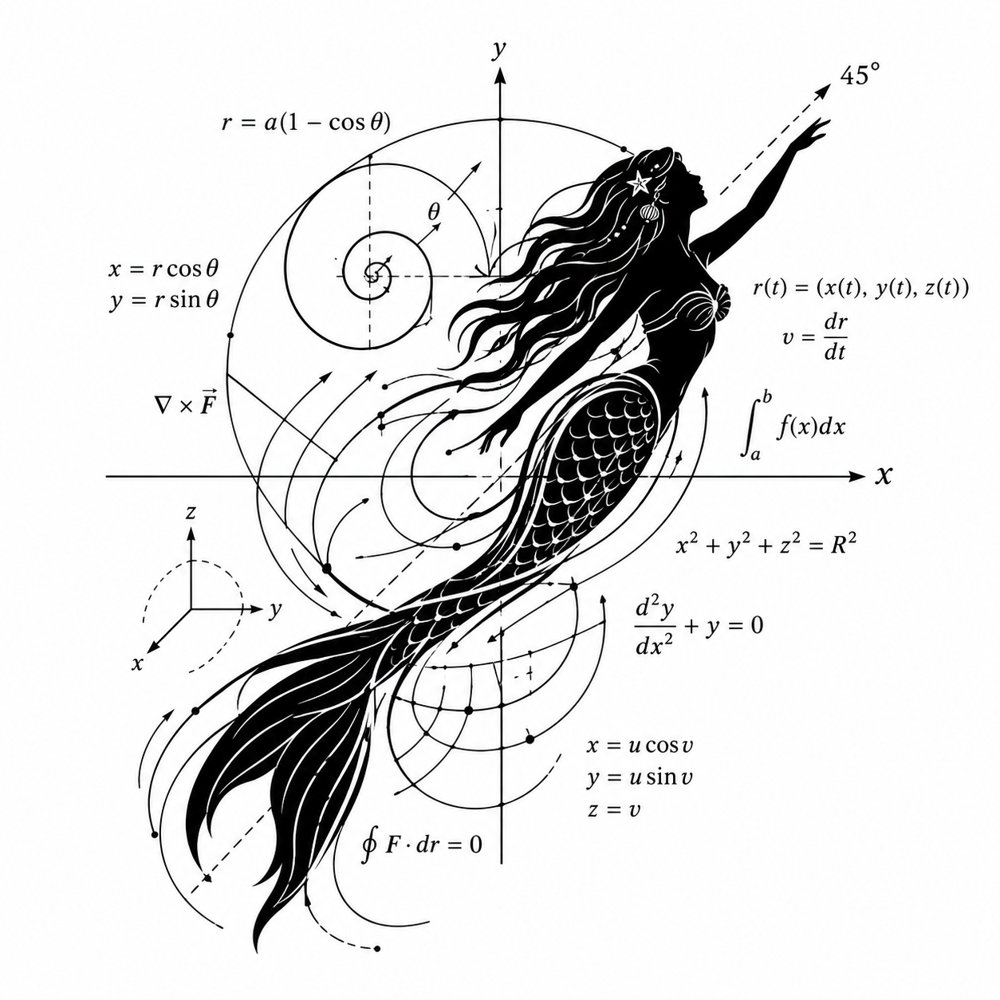
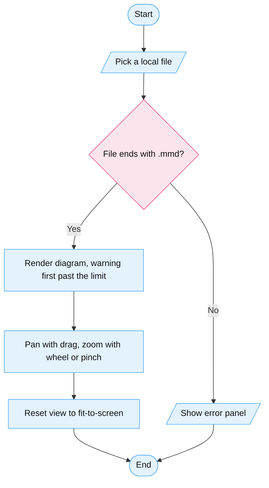

# VECTOR

One HTML file that renders `.mmd` diagrams offline. No server. No network. No install. Also ships as an npm package.

## Status

Spec stage. `docs/spec.md` holds the plan. The idea is grilled and recorded in `CONTEXT.md` and `docs/adr/`. The viewer file is not in this repo yet.

## How it will work

1. Open `VECTOR.html` in Chrome. It works with the network off.
2. Pick any local `.mmd` file.
3. The diagram fills the screen. Drag to pan. Use the wheel or pinch to zoom.
4. Reset view returns to fit-to-screen.
5. A bad file shows an error panel. Never a blank page.
6. The page logs each step to structured console lines. Agents read the console to drive the viewer and debug diagrams.
7. Every control carries a stable hook, so agent-browser drives it with no special setup. The picker takes file paths. `window.VECTOR` takes source text.
8. Past giant diagrams the viewer warns first. It tunes its own node limit from the hardware.

Figure 1 View

## Non-goals

- No editing. No saving. Viewer only.
- One file per view. No multi-file projects.
- No server half. Fully offline, fully local.

## Build notes

- The mermaid library ships inlined inside the HTML file. It tracks the latest stable at build time, verified 12.1.0 on 2026-10-05. No promise to follow future mermaid releases.
- The npm package runs a minuscule local backend, under 10 MB with zero dependencies. It reads the picked file, bakes its text into the viewer, then exits. Never idle.
- `npx vector diagram.mmd` opens one diagram. Render-done means SVG in the page. Fit-to-screen reports its own console event.
- Diagram node fills stay exactly as authored. The page never restyles diagram content.

## License

MIT. See `LICENSE`.
